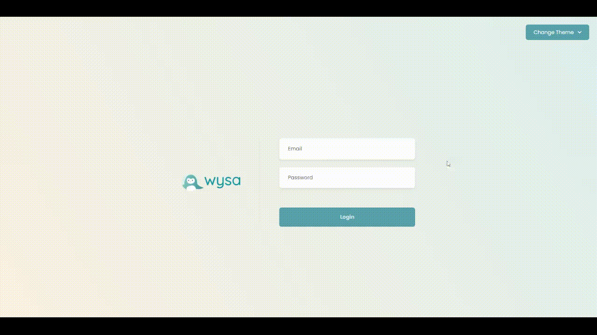
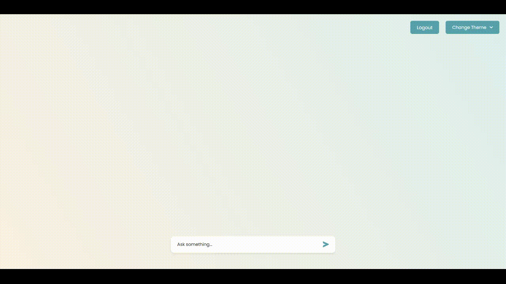

# Wysa Full-Stack Mini Project

A mockup application of Wysa's chat page with customizable profile themes. This app is made for Wysa's full stack mini project. It includes a login page mockup, a chat interaction page and theme changes with custom user profile.

## Live App

Open the [live app](https://wysa-mini-project-devansh.vercel.app/)

## Demo

The login and logout

The chat interaction

Changing the themes and setting custom colors

## Available Scripts

Close the repository and in the project folder you can run the following scripts

### `npm start`

Runs the app in the development mode.\
Open [http://localhost:3000](http://localhost:3000) to view it in the browser.

### `npm run build`

Builds the app for production to the `build` folder.\
It correctly bundles React in production mode and optimizes the build for the best performance.
